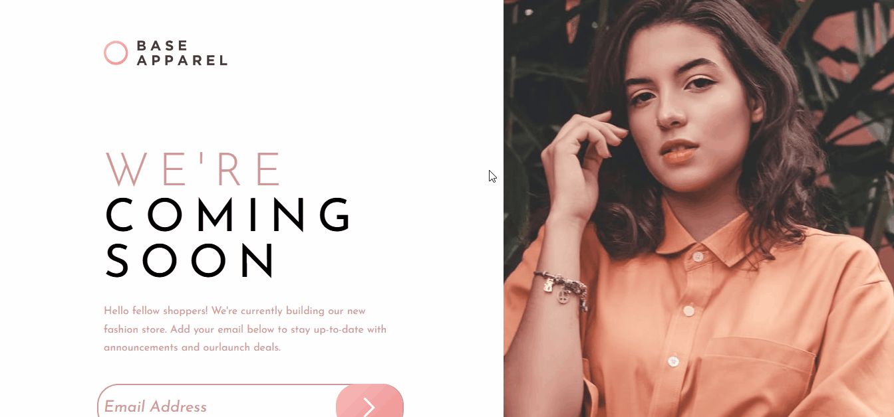

# Frontend Mentor - Base Apparel coming soon page solution

Esta é uma solução para o [Base Apparel coming soon page challenge on Frontend Mentor](https://www.frontendmentor.io/challenges/base-apparel-coming-soon-page-5d46b47f8db8a7063f9331a0). Os desafios do Frontend Mentor ajudam você a melhorar suas habilidades de codificação construindo projetos realistas.
### Screenshot




### Link

- URL do site ativo: [link aqui](https://andersonf-dev.github.io/Intro-component-with-sign-up-form/)

# Trecho de código usado js
```js

export const InputContainer = styled.div`
    width: 100%;
    max-width: 28.188rem;
    height: auto;
    display: flex;
    flex-direction: column;
    align-items: center;
    margin-bottom: 20px;  /* Menor margem para melhor controle do layout */
    border-radius: 2rem;
    position: relative; /* Necessário para posicionar a bola */
    margin-bottom: 30px;
    
`;

export const IconConteiner = styled.div`
    margin-right: 10px;
`;
```
### Criado com
- Marcação HTML5 semântica
- Propriedades personalizadas CSS
- Flexbox
- React
- styled-components
- JavaScript

### O que aprendi

- Aprendi a criar um card, posicionar elementos na tela, centralizar, criar e estilizar projetos em React.
- O tilezei o styled-components para fazer a estilização do projeto. 
- Criar uma validação para o input.
- Exibir uma mensagem de erro quando o usuário coloca um Email invalido
- Exibir uma imagem de erro dentro do input

### Desenvolvimento contínuo

Este é apenas mais um de muitos dos projetos de front end que fiz alem de CSS, HTML, JavaScript agora tambêm estou me desenvolvendo em React. Continuarei fazendo e me desenvolvendo ainda mais. Estou aprendendo cada dia mais, fazendo esses desafios, 